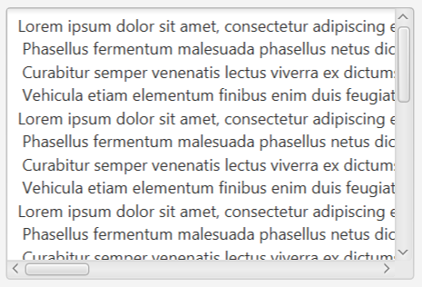
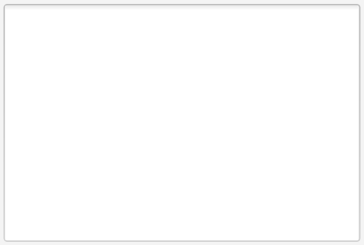
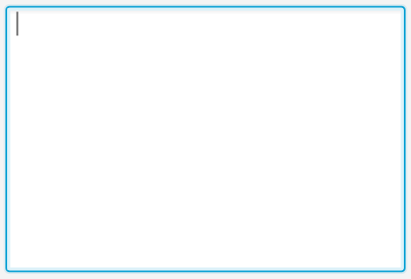
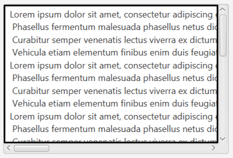
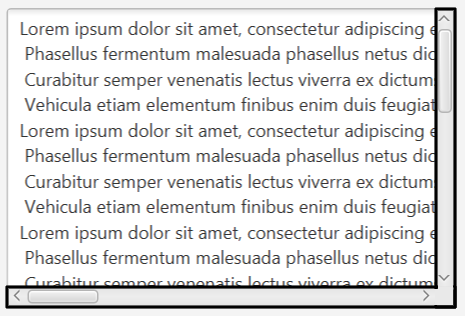
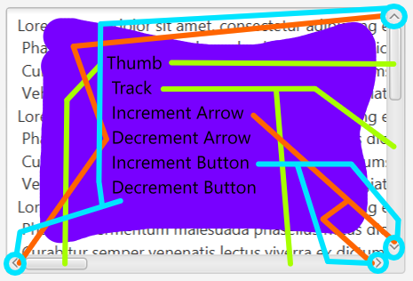

# Day 4, Jan 05, 2025

NOTE: No code is being written unless said so.

## Changeable CSS

Yesterday, I was successfully able to have changeable css via scene and removing
old css and adding new css. The problem is that the buttons are not changing colors.

So to fix it, I found a way to fix it. In my fxml, I added the css classes to the
objects. Below is an example of the structure of a javafx object.

```
Button:
- Inline CSS (For unchangable css)
- CSS Class (For changable css via scene)
- FX Id (For controller)
```

## Drowning in CSS

The point of this css is to be able to customize everything.

Armed with my IntelliJ IDEA JavaFX TestProject, VSCode CSS and SceneBuilder FXML, I
will start CSSing JavaFX.

### JavaFX CSS: TextArea

#### Node Hierarchy

```
|--- text-area > :hover :focused
|   |--- content > :hover
|   |--- scroll-pane > :hover
|   |   |--- increment-button > :hover
|   |   |--- decrement-button > :hover
|   |   |--- increment-arrow > :hover
|   |   |--- decrement-arrow > :hover
|   |   |--- thumb > :hover
|   |   |--- track > :hover
|   |   |--- corner > :hover
|   |   |--- track-background > :hover

```

Below are images explaining the javafx nodes.
- text-area

    

    This is the `TextArea` and a few important pseudo-classes are `:focused`
    and `:hover`. `:focused` is when the `TextArea` is selected. `:hover` is when
    the mouse is hovering over the `TextArea`.
  - Default/Hover Image: This how it looks when it is hovering
  
  - Focused Image: There is some a blue outline when it is selected
  

- content: The area where the text resides.

    


- scroll-pane: This area is all the scrolling is contained.

  


- scroll-pane parts

| ScrollBar Part Name | Representative Color |
|:-------------------:|:--------------------:|
|  increment-button   |         Red          |
|  decrement-button   |        Orange        |
|   increment-arrow   |        Yellow        |
|   decrement-arrow   |        Green         |
|        thumb        |         Cyan         |
|        track        |         Blue         |
|       corner        |        Purple        |
|                     |                      |

  
  

- scroll-pane

  


#### Sources/References
 - [JavaFX TextArea style with css](https://stackoverflow.com/questions/51594560/javafx-textarea-style-with-css) from Stack Overflow
 - [JavaFX CSS styling of TextArea does not work](https://stackoverflow.com/questions/21493634/javafx-css-styling-of-textarea-does-not-work) from Stack Overflow
 - [Styling a JavaFX Scrollbar](https://guigarage.com/2015/11/styling-a-javafx-scrollbar/) by Hendrik Ebbers
 - [JavaFX 8 scroll bar css](https://stackoverflow.com/questions/48048943/javafx-8-scroll-bar-css) from Stack Overflow


